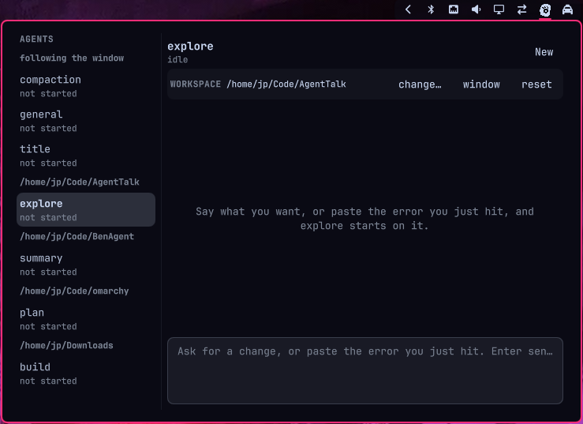

# AgentTalk

Talk to your [opencode](https://opencode.ai) agents from a panel in the Omarchy
bar. One click on the bar icon opens your agents: type a task or paste the error
you just hit, pick the agent, press Enter, and watch it work. The conversation
keeps going while you close the panel, change your theme, or restart your shell.



## Requirements

- [Omarchy](https://omarchy.org) with a running `omarchy-shell`
- [opencode](https://opencode.ai) on your `PATH` (or `AGENTTALK_OPENCODE_BIN` set)

AgentTalk does not need a build step, a runtime dependency, or a service. It is
a bar widget plus one shell script, both of which ship inside the plugin.

## Install

```bash
omarchy plugin add https://github.com/ramackersjp/AgentTalk.git --enable
```

The widget lands in the right-hand section of the bar. Move it wherever you
like, or change what it shows:

```bash
omarchy bar move io.github.ramackersjp.agenttalk --section center
```

`bin/agenttalk` is what the panel itself calls, and it is not on your `PATH`.
Put it there once if you want the command line; the panel does not need this.

```bash
ln -s ~/.config/omarchy/plugins/io.github.ramackersjp.agenttalk/bin/agenttalk \
  ~/.local/bin/agenttalk
```

Verify it found opencode:

```bash
agenttalk doctor
```

## Remove

```bash
omarchy plugin remove io.github.ramackersjp.agenttalk
```

Your conversations live in `~/.local/state/agenttalk` and are not touched by
removing the plugin. Delete that directory to forget them.

## Using it

| You want to | Do this |
| --- | --- |
| Open the panel | Click the bar icon, or run `omarchy-shell shell summon io.github.ramackersjp.agenttalk '{}'` |
| Talk to an agent | Type. The prompt is focused when the panel opens; Enter sends, Shift+Enter adds a line |
| Pick another agent | Click it on the left. The prompt keeps the keyboard, so the arrows move the caret, not the agent list |
| Start a fresh conversation | `New`, in the header |
| Stop a running agent | `Stop`, in the header, while the agent is working |
| Change where the next run happens | The `WORKSPACE` row: `change…` to type a path, `window` to follow the focused window, `reset` to forget it |
| Close the panel | Escape, or click outside it |

One conversation per agent, and they are independent: a `build` run keeps going
while you talk to `plan`. The default agent is picked for you — your configured
default, then opencode's `build`, then the first agent opencode lists.

### Settings

Right-click the bar icon, or set a value from the terminal:

```bash
omarchy bar set io.github.ramackersjp.agenttalk defaultAgent plan
```

| Setting | Default | What it does |
| --- | --- | --- |
| `autoApprove` | `true` | Lets agents edit files and run commands without stopping for permission. Turn it off if you want to answer permission requests yourself. |
| `defaultAgent` | *(empty)* | Agent selected when the panel opens. Empty picks `build`, or the first agent opencode reports. |
| `workDir` | *(empty)* | Where agents run. Empty means "the directory of the window you are focused on". |

### Keybinding

```bash
agenttalk bind SUPER CTRL A     # SUPER + CTRL + A opens the panel
agenttalk bind                  # the default, SUPER + A
agenttalk unbind                # remove it
```

The binding is written into `~/.config/hypr/bindings.lua` as one marked block,
so `agenttalk unbind` can take it away again and your own lines are left alone.

## The icon

The bar icon is [Flaticon's "artificial intelligence" symbol][flaticon], kept as
vector path data in `assets/icon.js` and filled with the colour your bar is
using for icons at that moment. That is why it does not look pasted on: it
follows light and dark themes, accent colours and bar sizes, exactly like the
Nerd Font icons around it.

`assets/icon.svg` is the vector source, and it was traced from the PNG that
Flaticon serves, because that site blocks automated downloads. `tools/png2svg.py`
does the tracing and `tools/svg2qml.py` turns the result into `assets/icon.js`; a
raster image is never what the bar draws, so a bar icon that does not match the
theme is the bug this whole arrangement exists to prevent. A Nerd Font agent
glyph is still in the widget as a fallback, so the slot is never empty if the
artwork is ever missing.

[flaticon]: https://www.flaticon.com/free-icon/artificial-intelligence_7007219?term=ai+symbol&page=1&position=32&origin=tag&related_id=7007219

## How it works

```
BarWidget.qml    the bar icon; loads the panel and keeps it alive
Panel.qml        agents, transcript, input; a view, nothing more
Session.qml      one agent's conversation, read from two files
Model.js         turns the event log into transcript blocks
bin/agenttalk    agents, runs, process groups, JSON normalisation, keybinding
```

`bin/agenttalk` owns everything that touches a process or the disk, so the panel
has no privileged logic and the awkward parts (process groups, JSON
normalisation, working-directory resolution) can be tested from a terminal. A
run is detached and appends to an event log, which is why it survives closing
the panel, reloading the plugin or restarting the shell:

```
$STATE/agents/<agent>/meta.json     session id, workdir, pid, exit code
$STATE/agents/<agent>/events.jsonl  one normalised event per line
$STATE/agents/<agent>/stderr.log    raw stderr of the last run
```

Events are normalised to a handful of shapes — `user`, `text`, `tool`, `error`,
`session`, `done` — so the panel never has to know opencode's internals. It
also means a future opencode release cannot break the transcript by renaming a
field.

## Command line

The same script the panel uses works in a terminal, which is handy when
something looks wrong:

```bash
agenttalk agents                        # agents as JSON
agenttalk run build "add a test"        # start a turn
agenttalk run build "add a test" --dir ~/Code/project
agenttalk stop build                    # stop it
agenttalk clear build                   # forget the conversation
agenttalk cwd                           # working directory of the focused window
agenttalk doctor                        # what the plugin can find
```

Without the symlink, call it by path:
`~/.config/omarchy/plugins/io.github.ramackersjp.agenttalk/bin/agenttalk doctor`.

| Variable | Meaning |
| --- | --- |
| `AGENTTALK_OPENCODE_BIN` | opencode binary to use |
| `AGENTTALK_STATE_DIR` | state directory override |
| `AGENTTALK_TIMEOUT` | seconds before a run is killed (default `3600`) |
| `HYPRLAND_CONFIG_DIR` | Hyprland config directory (default `~/.config/hypr`) |

## Troubleshooting

**The panel says no agents were found.** opencode is not where AgentTalk is
looking. `agenttalk doctor` prints the path it found, the version it reports and
whether the state directory is writable. If opencode lives somewhere unusual,
point the script at it with `AGENTTALK_OPENCODE_BIN=/path/to/opencode`, or make
sure `opencode` is on the `PATH` the shell passes to the widget.

**A run takes a long time to say anything.** opencode snapshots the working
directory before its first turn, and that is slow in a large directory. If the
focused window is your home directory, set `workDir` to the project you are
actually working on.

**The panel is empty after editing the plugin.** `omarchy-restart-shell`. Hot
reload does not always reinstantiate a bar widget that is already mounted.

## Development

```bash
omarchy plugin validate .              # manifest against the shell's schema
qmllint -I "$OMARCHY_PATH/shell" *.qml # QML, with Omarchy's imports resolved
bash -n bin/agenttalk                  # the bridge script
bash tools/test.sh                     # behaviour tests for the script
```

`qmllint` needs the `qs.*` imports that only exist in an Omarchy install, so it
runs on your machine rather than in CI; the workflow checks everything else. See
[AGENTS.md](AGENTS.md) for the rules this repository is worked under.

## License

MIT — see [LICENSE](LICENSE). The bar icon artwork is from
[Flaticon](https://www.flaticon.com/free-icon/artificial-intelligence_7007219?term=ai+symbol&page=1&position=32&origin=tag&related_id=7007219)
and is credited there; the code that draws it is part of this repository.
